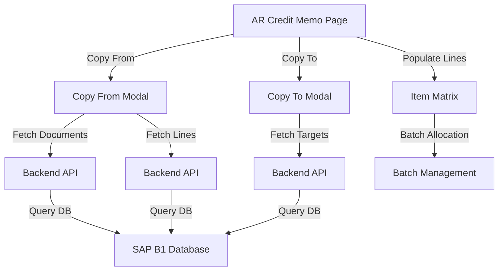

# Design Document: AR Credit Memo Copy From/Copy To Functionality

## Overview

This design implements SAP Business One-compatible Copy From and Copy To functionality for AR Credit Memos. Copy From allows users to populate credit memo lines from source documents (AR Invoice, Delivery, Sales Order) with automatic base reference tracking. Copy To enables propagating credit memo data to target documents (AR Invoice, Delivery) for reverse transactions. The implementation maintains SAP B1 data integrity through BaseEntry, BaseType, and BaseLine fields.

## Architecture



## Components and Interfaces

### Component 1: Copy From Modal

**Purpose**: Display available source documents and allow user selection to populate credit memo lines.

**Interface**:
```javascript
interface CopyFromModal {
  isOpen: boolean
  documentType: 'Invoice' | 'Delivery' | 'SalesOrder'
  cardCode: string
  onSelect(document: SourceDocument): void
  onClose(): void
}

interface SourceDocument {
  docEntry: number
  docNum: string
  docDate: string
  cardCode: string
  cardName: string
  balanceQty: number
  openAmount: number
  status: string
  lines: DocumentLine[]
}

interface DocumentLine {
  lineNum: number
  itemCode: string
  itemName: string
  openQty: number
  price: number
  taxCode: string
  warehouse: string
  baseEntry: number
  baseType: number
  baseLine: number
}
```

**Responsibilities**:
- Fetch open documents for selected customer
- Display document list with key information
- Allow row selection
- Fetch and display line items for selected document
- Pass selected data to parent component for population

### Component 2: Copy To Modal

**Purpose**: Display target documents and enable copying credit memo data for reverse transactions.

**Interface**:
```javascript
interface CopyToModal {
  isOpen: boolean
  creditMemoData: CreditMemoData
  onClose(): void
}

interface CreditMemoData {
  docEntry: number
  docNum: string
  header: HeaderData
  lines: LineData[]
}

interface TargetDocument {
  docEntry: number
  docNum: string
  docDate: string
  cardCode: string
  cardName: string
  documentType: 'Invoice' | 'Delivery'
}
```

**Responsibilities**:
- Display available target documents
- Allow selection of target document type
- Pass credit memo data to backend for creation
- Handle success/error responses

### Component 3: Item Matrix Integration

**Purpose**: Populate item matrix with copied line data.

**Interface**:
```javascript
interface ItemMatrixLine {
  baseEntry: number | null
  baseType: number | null
  baseLine: number | null
  itemNo: string
  itemDescription: string
  hsnCode: string
  quantity: string
  unitPrice: string
  stdDiscount: string
  taxCode: string
  total: string
  whse: string
  uomCode: string
  batchManaged: boolean
  batches: BatchAllocation[]
}

interface BatchAllocation {
  batchNumber: string
  quantity: string
  expiryDate: string
}
```

**Responsibilities**:
- Accept copied line data
- Validate and format data
- Populate item matrix rows
- Trigger batch allocation if batch-managed
- Recalculate totals and taxes

## Data Models

### Source Document Model

```javascript
interface SourceDocumentHeader {
  docEntry: number
  docNum: string
  docDate: string
  cardCode: string
  cardName: string
  status: 'O' | 'C'  // Open or Closed
  cancelled: boolean
}

interface SourceDocumentLine {
  lineNum: number
  itemCode: string
  dscription: string
  openQty: number  // Quantity - QuantityReturned
  price: number
  taxCode: string
  whsCode: string
  baseEntry: number
  baseType: number
  baseLine: number
}
```

### Base Reference Model

```javascript
interface BaseReference {
  baseEntry: number    // DocEntry of source document
  baseType: number     // 13=Invoice, 15=Delivery, 17=SalesOrder
  baseLine: number     // LineNum in source document
}

// BaseType Constants
const BASE_TYPES = {
  INVOICE: 13,
  DELIVERY: 15,
  SALES_ORDER: 17
}
```

### Copy To Target Model

```javascript
interface CopyToPayload {
  sourceDocEntry: number
  sourceDocType: number
  targetDocType: 'Invoice' | 'Delivery'
  header: {
    cardCode: string
    cardName: string
    docDate: string
    docDueDate: string
    postingDate: string
    documentDate: string
    branch: string
    paymentTerms: string
    remarks: string
  }
  lines: {
    itemCode: string
    quantity: number
    unitPrice: number
    warehouse: string
    taxCode: string
    baseEntry: number
    baseType: number
    baseLine: number
  }[]
}
```

## Algorithmic Pseudocode

### Main Copy From Workflow

```pascal
ALGORITHM copyFromDocument(sourceDocEntry, sourceDocType, cardCode)
INPUT: sourceDocEntry (document entry), sourceDocType (13/15/17), cardCode (customer code)
OUTPUT: populatedLines (array of line items with base references)

BEGIN
  ASSERT cardCode IS NOT NULL AND cardCode IS NOT EMPTY
  ASSERT sourceDocEntry > 0
  ASSERT sourceDocType IN {13, 15, 17}
  
  // Step 1: Fetch source document header
  sourceHeader ← fetchSourceDocumentHeader(sourceDocEntry, sourceDocType)
  
  IF sourceHeader IS NULL THEN
    RETURN Error("Source document not found")
  END IF
  
  ASSERT sourceHeader.CardCode = cardCode
  ASSERT sourceHeader.Status = 'O'  // Open only
  ASSERT sourceHeader.Cancelled = FALSE
  
  // Step 2: Fetch source document lines with open quantities
  sourceLines ← fetchSourceDocumentLines(sourceDocEntry, sourceDocType)
  
  IF sourceLines IS EMPTY THEN
    RETURN Error("No open lines found in source document")
  END IF
  
  // Step 3: Transform lines to credit memo format
  populatedLines ← EMPTY ARRAY
  
  FOR EACH sourceLine IN sourceLines DO
    ASSERT sourceLine.OpenQty > 0
    
    transformedLine ← {
      baseEntry: sourceDocEntry,
      baseType: sourceDocType,
      baseLine: sourceLine.LineNum,
      itemNo: sourceLine.ItemCode,
      itemDescription: sourceLine.Dscription,
      hsnCode: fetchHSNCode(sourceLine.ItemCode),
      quantity: sourceLine.OpenQty,
      unitPrice: sourceLine.Price,
      taxCode: sourceLine.TaxCode,
      whse: sourceLine.WhsCode,
      uomCode: fetchItemUOM(sourceLine.ItemCode),
      stdDiscount: 0,
      total: sourceLine.OpenQty * sourceLine.Price
    }
    
    // Step 4: Check batch availability if item is batch-managed
    IF isBatchManaged(sourceLine.ItemCode) THEN
      transformedLine.batchManaged ← TRUE
      transformedLine.batches ← fetchBatchesForItem(
        sourceLine.ItemCode, 
        sourceLine.WhsCode
      )
    END IF
    
    populatedLines.ADD(transformedLine)
  END FOR
  
  ASSERT ALL(populatedLines, line => line.baseEntry = sourceDocEntry)
  ASSERT ALL(populatedLines, line => line.baseType = sourceDocType)
  ASSERT ALL(populatedLines, line => line.baseLine >= 0)
  
  RETURN populatedLines
END
```

**Preconditions**:
- cardCode is non-empty and valid
- sourceDocEntry is positive integer
- sourceDocType is valid (13, 15, or 17)
- Source document exists and belongs to same customer
- Source document is in Open status
- Source document is not cancelled

**Postconditions**:
- All returned lines have valid baseEntry, baseType, baseLine
- All returned lines have openQty > 0
- All returned lines have required fields populated
- Batch information included for batch-managed items
- No mutations to source document

**Loop Invariants**:
- All processed lines have valid base references
- All processed lines have positive quantities
- All processed lines belong to same source document

### Fetch Open Documents Algorithm

```pascal
ALGORITHM fetchOpenDocuments(cardCode, documentType)
INPUT: cardCode (customer code), documentType ('Invoice'|'Delivery'|'SalesOrder')
OUTPUT: openDocuments (array of open documents)

BEGIN
  ASSERT cardCode IS NOT NULL AND cardCode IS NOT EMPTY
  ASSERT documentType IN {'Invoice', 'Delivery', 'SalesOrder'}
  
  // Determine table and base type based on document type
  CASE documentType OF
    'Invoice': 
      table ← 'OINV'
      baseType ← 13
    'Delivery':
      table ← 'ODLN'
      baseType ← 15
    'SalesOrder':
      table ← 'ORDR'
      baseType ← 17
  END CASE
  
  // Query open documents for customer
  query ← "
    SELECT DocEntry, DocNum, DocDate, CardCode, CardName, 
           DocStatus, Cancelled
    FROM " + table + "
    WHERE CardCode = @cardCode
      AND DocStatus = 'O'
      AND Cancelled = 'N'
      AND EXISTS (
        SELECT 1 FROM " + getLineTable(table) + " T1
        WHERE T1.DocEntry = " + table + ".DocEntry
          AND (T1.Quantity - T1.QuantityReturned) > 0
      )
    ORDER BY DocDate DESC
  "
  
  openDocuments ← executeQuery(query, { cardCode })
  
  ASSERT ALL(openDocuments, doc => doc.CardCode = cardCode)
  ASSERT ALL(openDocuments, doc => doc.DocStatus = 'O')
  ASSERT ALL(openDocuments, doc => doc.Cancelled = 'N')
  
  RETURN openDocuments
END
```

**Preconditions**:
- cardCode is non-empty
- documentType is valid
- Database connection available

**Postconditions**:
- All returned documents belong to specified customer
- All returned documents are in Open status
- All returned documents have at least one open line
- No cancelled documents included

**Loop Invariants**: N/A (single query execution)

### Validate Base Reference Algorithm

```pascal
ALGORITHM validateBaseReference(baseEntry, baseType, baseLine)
INPUT: baseEntry (source doc entry), baseType (doc type), baseLine (line number)
OUTPUT: isValid (boolean)

BEGIN
  // Validate base type
  IF baseType NOT IN {13, 15, 17} THEN
    RETURN FALSE
  END IF
  
  // Validate base entry
  IF baseEntry <= 0 THEN
    RETURN FALSE
  END IF
  
  // Validate base line
  IF baseLine < 0 THEN
    RETURN FALSE
  END IF
  
  // Verify source document exists
  sourceDoc ← fetchSourceDocument(baseEntry, baseType)
  
  IF sourceDoc IS NULL THEN
    RETURN FALSE
  END IF
  
  // Verify line exists in source document
  sourceLine ← fetchSourceLine(baseEntry, baseType, baseLine)
  
  IF sourceLine IS NULL THEN
    RETURN FALSE
  END IF
  
  // Verify line has open quantity
  IF sourceLine.OpenQty <= 0 THEN
    RETURN FALSE
  END IF
  
  RETURN TRUE
END
```

**Preconditions**:
- All parameters are provided
- Database connection available

**Postconditions**:
- Returns boolean indicating validity
- No side effects on data

**Loop Invariants**: N/A (validation only)

## Key Functions with Formal Specifications

### Function 1: fetchOpenDocuments()

```javascript
async function fetchOpenDocuments(cardCode, documentType)
```

**Preconditions**:
- `cardCode` is non-empty string
- `documentType` is one of: 'Invoice', 'Delivery', 'SalesOrder'
- Database connection is active

**Postconditions**:
- Returns array of documents with DocEntry, DocNum, DocDate, CardCode, CardName, Status
- All returned documents have CardCode matching input
- All returned documents have Status = 'O' (Open)
- All returned documents have at least one line with OpenQty > 0
- No cancelled documents included
- Array sorted by DocDate descending

**Loop Invariants**: N/A

### Function 2: fetchDocumentLines()

```javascript
async function fetchDocumentLines(docEntry, docType)
```

**Preconditions**:
- `docEntry` is positive integer
- `docType` is one of: 13 (Invoice), 15 (Delivery), 17 (SalesOrder)
- Source document exists

**Postconditions**:
- Returns array of line objects with: LineNum, ItemCode, ItemName, OpenQty, Price, TaxCode, Warehouse
- All returned lines have OpenQty > 0
- All returned lines have valid ItemCode
- All returned lines include base reference fields (BaseEntry, BaseType, BaseLine)
- Array sorted by LineNum ascending

**Loop Invariants**: N/A

### Function 3: populateItemMatrix()

```javascript
function populateItemMatrix(creditMemoLines, sourceLines)
```

**Preconditions**:
- `creditMemoLines` is array of line objects
- `sourceLines` is array of source document lines
- All lines have required fields: itemNo, quantity, unitPrice, taxCode, whse
- All lines have valid base references if from source document

**Postconditions**:
- Item matrix populated with all lines
- All lines have calculated totals: quantity * unitPrice
- All lines have tax codes applied
- Batch allocations loaded for batch-managed items
- UI updated to reflect new lines
- No mutations to input arrays

**Loop Invariants**:
- All processed lines maintain base reference integrity
- All processed lines have valid item codes
- All processed lines have positive quantities

### Function 4: validateCopyFromSelection()

```javascript
function validateCopyFromSelection(sourceDocEntry, sourceDocType, cardCode)
```

**Preconditions**:
- `sourceDocEntry` is positive integer
- `sourceDocType` is valid (13, 15, or 17)
- `cardCode` is non-empty string
- Source document exists

**Postconditions**:
- Returns validation result with isValid boolean and error message if invalid
- If valid: isValid = true, error = null
- If invalid: isValid = false, error = descriptive message
- Checks: document exists, belongs to customer, is open, not cancelled, has open lines

**Loop Invariants**: N/A

## Example Usage

### Copy From Workflow

```javascript
// Step 1: User clicks "Copy From" button
// Step 2: Modal opens showing available source documents
const sourceDocuments = await fetchOpenDocuments('CUS001', 'Invoice');
// Returns: [
//   { docEntry: 123, docNum: 'INV-001', docDate: '2024-01-15', 
//     cardCode: 'CUS001', cardName: 'Customer A', status: 'O' },
//   { docEntry: 124, docNum: 'INV-002', docDate: '2024-01-16', 
//     cardCode: 'CUS001', cardName: 'Customer A', status: 'O' }
// ]

// Step 3: User selects document INV-001
const selectedDocEntry = 123;
const selectedDocType = 13;

// Step 4: Fetch lines from selected document
const sourceLines = await fetchDocumentLines(123, 13);
// Returns: [
//   { lineNum: 0, itemCode: 'ITEM001', itemName: 'Product A', 
//     openQty: 10, price: 100, taxCode: 'GST18', warehouse: 'WH01',
//     baseEntry: 123, baseType: 13, baseLine: 0 },
//   { lineNum: 1, itemCode: 'ITEM002', itemName: 'Product B', 
//     openQty: 5, price: 200, taxCode: 'GST18', warehouse: 'WH01',
//     baseEntry: 123, baseType: 13, baseLine: 1 }
// ]

// Step 5: Populate item matrix
const creditMemoLines = sourceLines.map(line => ({
  baseEntry: line.baseEntry,
  baseType: line.baseType,
  baseLine: line.baseLine,
  itemNo: line.itemCode,
  itemDescription: line.itemName,
  quantity: String(line.openQty),
  unitPrice: String(line.price),
  taxCode: line.taxCode,
  whse: line.warehouse,
  stdDiscount: '0',
  total: String(line.openQty * line.price),
  uomCode: 'EA',
  batchManaged: false,
  batches: []
}));

// Step 6: Update state and close modal
setFormData(prev => ({
  ...prev,
  lines: creditMemoLines
}));
closeCopyFromModal();

// Step 7: Recalculate totals and taxes
recalculateAllTotals();
```

### Copy To Workflow

```javascript
// Step 1: User saves AR Credit Memo
const creditMemoData = {
  docEntry: 456,
  docNum: 'CM-001',
  header: {
    cardCode: 'CUS001',
    cardName: 'Customer A',
    postingDate: '2024-01-20',
    deliveryDate: '2024-01-25'
  },
  lines: [
    { itemCode: 'ITEM001', quantity: 10, unitPrice: 100, 
      warehouse: 'WH01', taxCode: 'GST18',
      baseEntry: 123, baseType: 13, baseLine: 0 }
  ]
};

// Step 2: User clicks "Copy To" button
// Step 3: Modal opens showing target document options
const targetDocuments = await fetchTargetDocuments('CUS001');

// Step 4: User selects target document type (Invoice or Delivery)
const targetDocType = 'Invoice';

// Step 5: Backend creates reverse transaction
const copyToPayload = {
  sourceDocEntry: 456,
  sourceDocType: 14,  // Credit Memo
  targetDocType: 'Invoice',
  header: creditMemoData.header,
  lines: creditMemoData.lines
};

const result = await copyToDocument(copyToPayload);
// Returns: { success: true, docEntry: 789, docNum: 'INV-003' }

// Step 6: Show success message
showNotification('Reverse invoice created: INV-003');
```

## Correctness Properties

### Property 1: Base Reference Integrity

```javascript
// For all lines copied from source document:
// baseEntry must match source document entry
// baseType must match source document type
// baseLine must match source line number

∀ line ∈ creditMemoLines:
  IF line.baseEntry ≠ null THEN
    line.baseType ∈ {13, 15, 17} ∧
    line.baseEntry > 0 ∧
    line.baseLine ≥ 0 ∧
    sourceDocumentExists(line.baseEntry, line.baseType) ∧
    sourceLineExists(line.baseEntry, line.baseType, line.baseLine)
```

### Property 2: Open Quantity Preservation

```javascript
// Copied quantity must not exceed open quantity in source document

∀ line ∈ creditMemoLines:
  IF line.baseEntry ≠ null THEN
    Number(line.quantity) ≤ getSourceLineOpenQty(
      line.baseEntry, 
      line.baseType, 
      line.baseLine
    )
```

### Property 3: Customer Consistency

```javascript
// All copied lines must belong to same customer as credit memo

∀ line ∈ creditMemoLines:
  IF line.baseEntry ≠ null THEN
    getSourceDocumentCustomer(line.baseEntry, line.baseType) = 
    creditMemoHeader.cardCode
```

### Property 4: Document Status Validation

```javascript
// Source documents must be in Open status and not cancelled

∀ sourceDoc ∈ selectedSourceDocuments:
  sourceDoc.status = 'O' ∧
  sourceDoc.cancelled = false ∧
  sourceDoc.cardCode = creditMemoHeader.cardCode
```

### Property 5: Batch Allocation Consistency

```javascript
// For batch-managed items, total batch quantities must equal line quantity

∀ line ∈ creditMemoLines:
  IF line.batchManaged = true THEN
    SUM(batch.quantity FOR batch IN line.batches) = Number(line.quantity)
```

## Error Handling

### Error Scenario 1: Source Document Not Found

**Condition**: Selected source document entry does not exist in database
**Response**: Display error modal: "Source document not found. Please select a valid document."
**Recovery**: Return to Copy From modal, allow user to select different document

### Error Scenario 2: No Open Lines

**Condition**: Source document exists but has no lines with open quantity > 0
**Response**: Display warning: "Selected document has no open lines available for copying."
**Recovery**: Return to Copy From modal, suggest selecting different document

### Error Scenario 3: Customer Mismatch

**Condition**: Source document belongs to different customer than credit memo
**Response**: Display error: "Source document customer does not match credit memo customer."
**Recovery**: Return to Copy From modal, filter documents by correct customer

### Error Scenario 4: Document Cancelled

**Condition**: Source document is cancelled
**Response**: Display error: "Cannot copy from cancelled document."
**Recovery**: Return to Copy From modal, show only non-cancelled documents

### Error Scenario 5: Invalid Base Reference

**Condition**: Line has invalid baseEntry, baseType, or baseLine
**Response**: Log error, skip line, display warning: "One or more lines have invalid base references and were skipped."
**Recovery**: Allow user to manually add lines or select different source document

### Error Scenario 6: Batch Quantity Mismatch

**Condition**: Sum of batch quantities does not equal line quantity
**Response**: Display error: "Batch quantities do not match line quantity. Please adjust batch allocations."
**Recovery**: Allow user to edit batch allocations

## Testing Strategy

### Unit Testing Approach

**Test Cases for Copy From**:
1. Fetch open documents - verify filtering by customer, status, and open lines
2. Fetch document lines - verify open quantity calculation (Qty - QtyReturned)
3. Transform lines - verify base reference assignment
4. Validate base reference - verify all validation rules
5. Batch availability check - verify batch detection for batch-managed items

**Test Cases for Copy To**:
1. Validate copy to eligibility - verify credit memo is saved
2. Create reverse transaction - verify target document creation
3. Maintain base references - verify reverse reference tracking

**Test Cases for Item Matrix Integration**:
1. Populate lines - verify all fields populated correctly
2. Calculate totals - verify quantity * price calculation
3. Apply tax codes - verify tax code assignment
4. Batch allocation - verify batch data loaded

### Property-Based Testing Approach

**Property Test Library**: fast-check (JavaScript)

**Property Tests**:
1. Base Reference Integrity: For any valid source document and line, copied line must have matching base references
2. Open Quantity Preservation: Copied quantity must never exceed source open quantity
3. Customer Consistency: All copied lines must belong to same customer
4. Document Status: Only open, non-cancelled documents can be copied
5. Batch Allocation: For batch-managed items, batch quantities must sum to line quantity

### Integration Testing Approach

**Test Scenarios**:
1. End-to-end Copy From: Select document → Fetch lines → Populate matrix → Verify data
2. End-to-end Copy To: Save credit memo → Select target → Create reverse transaction → Verify creation
3. Multi-line Copy: Copy document with multiple lines → Verify all lines populated
4. Batch-managed Items: Copy document with batch items → Verify batch allocation
5. Error Handling: Test all error scenarios and recovery paths

## Performance Considerations

**Query Optimization**:
- Index on OINV.CardCode, OINV.DocStatus, OINV.Cancelled for fast filtering
- Index on INV1.Quantity, INV1.QuantityReturned for open quantity calculation
- Use EXISTS clause to filter documents with open lines efficiently

**Caching Strategy**:
- Cache reference data (items, warehouses, tax codes) for 5 minutes
- Cache customer details for 10 minutes
- Invalidate cache on document save

**UI Performance**:
- Lazy load document list (pagination, 20 items per page)
- Debounce customer selection (300ms) before fetching documents
- Show loading indicator during API calls
- Limit modal table to 100 rows with scrolling

## Security Considerations

**Authorization**:
- Verify user has permission to create/edit AR Credit Memos
- Verify user has permission to view source documents
- Verify user has permission to create target documents

**Data Validation**:
- Validate all input parameters (cardCode, docEntry, docType)
- Sanitize string inputs to prevent SQL injection
- Validate numeric inputs are within acceptable ranges
- Verify base references point to valid documents

**Audit Trail**:
- Log all Copy From operations with user, timestamp, source document
- Log all Copy To operations with user, timestamp, target document
- Track base reference assignments for traceability

## Dependencies

**Backend**:
- SAP B1 Service Layer API for document creation/update
- SQL Server database for querying documents and lines
- Node.js Express server for API endpoints

**Frontend**:
- React for UI components
- React Router for navigation
- Axios for HTTP requests
- CSS for styling

**External**:
- SAP B1 system with proper configuration
- SQL Server with appropriate permissions
- Network connectivity to SAP B1 server
